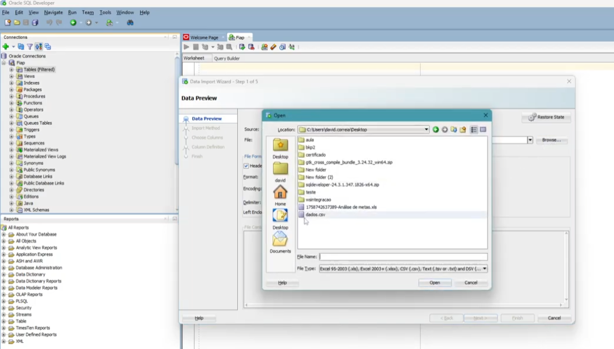
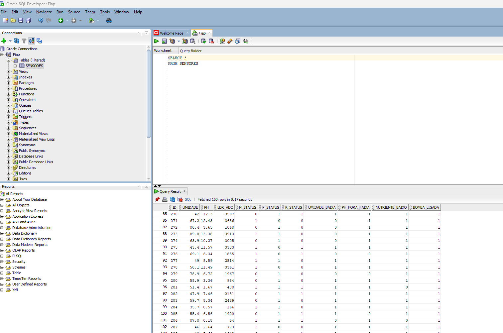
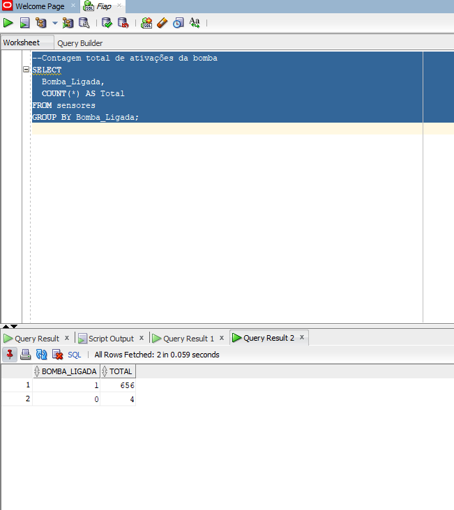
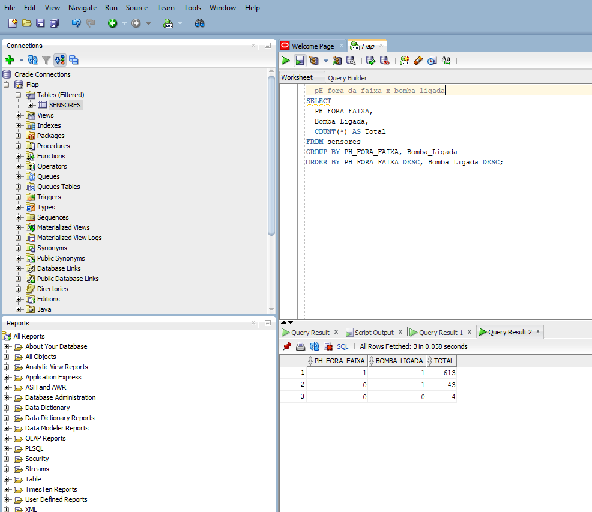
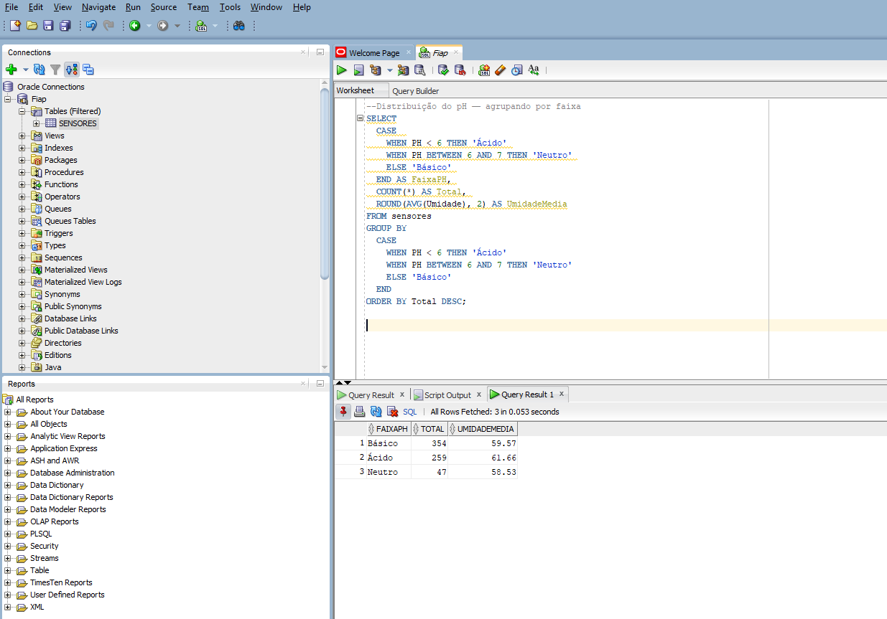
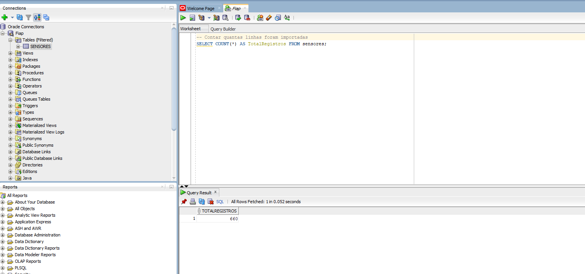
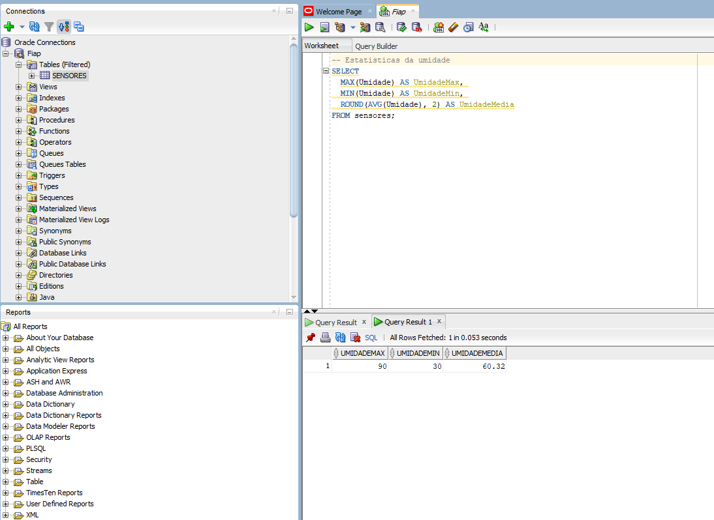
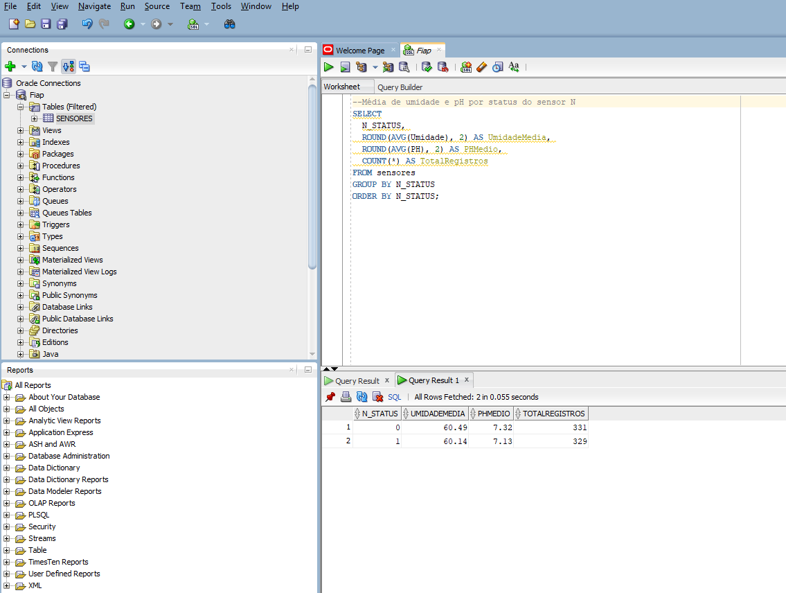

# FIAP - Faculdade de Informática e Administração Paulista  

<p align="center">
<a href="https://www.fiap.com.br/"></a>
</p>

<br>

# FarmTech Solutions – Fase 3: Etapas de uma Máquina Agrícola  

## 👨‍💻 Integrantes
- [Leticia Grossi Dornelas - RM568172](https://www.linkedin.com/in/leticiagdornelas/)
- [Leonardo Borges Alves da Mota - RM566939](https://www.linkedin.com/in/leonardo-borges-alves-da-mota-649703177/)  
- [Bernardo Naves Doti Avelar - RM566867](https://www.linkedin.com/in/bernardo-doti/)  
- [David Eduardo da Silva Correia - RM567525](https://www.linkedin.com/in/eduardo-correia-29327631/)

## 👩‍🏫 Professores  
### Tutor(a)
- Ana Cristina dos Santos 
### Coordenador(a)
- André Godoi Chiovato

---

## 📜 Descrição  

Este projeto corresponde à **Fase 3 do PBL** do curso de **Inteligência Artificial** da FIAP, desenvolvido pela equipe **FarmTech Solutions**, uma startup fictícia focada em aplicar **Inteligência Artificial no setor do agronegócio**.  

Nesta fase, o grupo implementou um **banco de dados relacional Oracle** para armazenar e consultar os dados coletados pelos sensores agrícolas da Fase 2. O objetivo é estruturar, importar e explorar esses dados, garantindo persistência, integridade e facilidade de análise para futuras aplicações de IA.  

A atividade reforça conceitos de **modelagem de dados, consultas SQL e integração entre software e banco de dados** em um contexto prático de automação agrícola.  

---

## 🎯 Objetivo da Fase 3  

- Criar e configurar uma conexão com o banco de dados Oracle.  
- Importar o arquivo de dados da **Fase 2** (coleta dos sensores - dados simulados).  
- Executar consultas SQL (SELECT, filtros, ordenações).  
- Documentar os passos seguidos e resultados obtidos.  
- Organizar o repositório e o README de forma profissional.  

---

## ⚙️ Metodologia e Ferramentas  

Ferramentas e tecnologias utilizadas nesta fase:  

- **Oracle SQL Developer** → criação e manipulação do banco de dados.  
- **Arquivo CSV da Fase 2** → dados de sensores (umidade, temperatura, pH, nutrientes etc.).  
- **GitHub** → versionamento e documentação do projeto.  
- **Prints de tela** → evidências das etapas realizadas.  

---

## 🔧 Como Executar  

### 1️⃣ Instalar o Oracle SQL Developer  
Baixe o software em: [https://www.oracle.com/database/sqldeveloper/technologies/download/](https://www.oracle.com/database/sqldeveloper/technologies/download/)  
Escolha a versão correspondente ao seu sistema operacional e instale normalmente.  

### 2️⃣ Configurar a conexão  
No Oracle SQL Developer, clique em **Nova Conexão** e insira:  
- **Nome:** FIAP  
- **Host:** oracle.fiap.com.br  
- **Porta:** 1521  
- **SID:** ORCL  
- **Usuário:** RMXXXXX  
- **Senha:** Data de nascimento no formato DDMMYY  

Clique em **Testar** → Se aparecer “Status: Sucesso”, clique em **Salvar** e depois **Conectar**.  

### 3️⃣ Importar os dados da Fase 2  
1. Clique com o botão direito em **Tabelas (Filtrado)** → **Importar Dados**  
2. Selecione o arquivo da Fase 2 (.csv).  
3. Defina o nome da tabela (exemplo: `Sensores`).  
4. Mantenha as configurações padrão e finalize a importação.  
5. Aguarde a mensagem de sucesso.  

### 4️⃣ Executar consultas SQL  
Após a importação, execute:  
```sql
SELECT * FROM Sensores;
```
Use **Ctrl + Enter** para rodar a query e visualizar os dados importados.  

---

## 📸 Prints, Evidências e link do vídeo explicativo

> Abaixo, insira as imagens referentes às etapas do processo.  

**Código C++–** Código utilizado para simular os dados dos sensores do Wokwi em um arquivo CSV.  
  

**Arquivo CSV –** Base de dados dos sensores com ID, UMIDADE, PH, LDR_ADC, N_STATUS, P_STATUS, K_STATUS, UMIDADE_BAIXA, PH_FORA_FAIXA, NUTRIENTE_BAIXO, BOMBA_LIGADA.  
  

**Figura 1 –** Importando os dados dos sensores no banco Oracle.  
  

**Figura 2 –** Consulta geral no banco de dados no arquivo dos sensores.  
  

**Figura 3 –** Consulta realizando a contagem total de ativações da bomba.  
  

**Figura 4 –** Consulta relacionando a contagem de ph fora da faixa com a boomba ligada.  
  

**Figura 5 –** Consulta mostrando a distribuição do pH e agrupando por faixa.  
  

**Figura 6 –** Consulta realizando a contagem de total de linhas importadas do arquivo CSV.  
  

**Figura 7 –** Consulta realizando estatísticas da Umidade, calculando média, valor máximo e mínimo.  
  

**Figura 8 –** Consulta realizando a média de umidade e pH por status do sensor N.  
  

**Código SQL –** Consolidade dos códigos SQL utilizados para realizar as consultas no banco de dados.  
  

**Link do vídeo –** Link do vídeo demonstrando a simulação dos dados dos sensores do Wokwi, importação no banco de dados e realização de consulta geral mostrando que o arquivo CSV integrou no banco corretamente.
https://youtu.be/IkERE1Thqig

---

## 📁 Estrutura de Pastas  

```
/assets           → imagens e prints usados no README  
/document         → relatórios, evidências e documentos de apoio  
/src              → scripts SQL usados na importação e consultas  
/README.md        → documentação principal do projeto  
```

---

## 📈 Resultados e Aprendizados  

- Conexão bem-sucedida com o banco Oracle da FIAP.  
- Importação completa e validação dos dados da Fase 2.  
- Execução de consultas SQL básicas com sucesso.  
- Aprendizado prático sobre integração entre software e banco de dados.  
- Estruturação do repositório com documentação clara e organizada.  

---

## 🗃 Histórico de Lançamentos  

* 0.1.0 - 12/11/2025  
  * Entrega da Fase 3 – Banco de Dados Oracle.  

---

## 📋 Licença  


<p xmlns:cc="http://creativecommons.org/ns#" xmlns:dct="http://purl.org/dc/terms/">
<a property="dct:title" rel="cc:attributionURL" href="https://github.com/agodoi/template">MODELO GIT FIAP</a> por <a rel="cc:attributionURL dct:creator" property="cc:attributionName" href="https://fiap.com.br">Fiap</a> está licenciado sob 
<a href="http://creativecommons.org/licenses/by/4.0/?ref=chooser-v1" target="_blank" rel="license noopener noreferrer" style="display:inline-block;">Attribution 4.0 International</a>.
</p>
